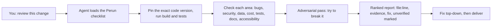

# Perun

*A second pair of eyes for AI-written code: a free checklist that makes the
review thorough, ranked and checkable.*

[](https://github.com/remigiusz-antczak/deep-code-review/actions/workflows/ci.yml)
[](LICENSE)

**Perun is a free checklist that an AI coding assistant follows to review
software the same careful way every time. In a 30-case test it found about 3 in
10 hidden bugs, against about 2 in 10 for the same assistant asked to "review
this" (the gain is likely but not certain; see [Proof](#proof)). Every problem
it reports points to the exact file and line, ranks how serious it is, and says
how to fix it. What it cannot prove, it labels `unverified` instead of
guessing. The trade-off: it costs about 1.75 times as much model usage as a
plain review.**

*Naming: Perun is the project; `deep-code-review` is the repository and the
main skill inside it.*

- **What it is:** a set of plain-text instruction files (called *skills*) that
  an AI coding assistant (called an *agent*) reads before it reviews code. There
  is no server and no account. Think of a pilot's pre-flight checklist: the
  method lives in the checklist, not in anyone's memory.
- **Who it is for:** anyone who ships software with an AI assistant, and anyone
  who has to rely on the result: engineers, engineering managers, security,
  finance, product and marketing. Each gets something different
  ([by role](#what-each-person-gets)).
- **Why trust it:** it was measured against the plain assistant on 30 real bug
  fixes it had never seen. One pass caught about 1.5 times as many bugs; two
  merged passes about 2 times as many, at about 3.5 times the cost. A somewhat
  larger share of what it flagged was real
  ([Proof](#proof), with a link to the data). It also lists what it misses
  ([Limits](#limits)). Free (MIT licence), runs on your machine, works with many
  agents.
- **Not technical?** Read [the story](#the-story-one-change-five-steps), then
  [what each person gets](#what-each-person-gets), and forward
  [Quickstart](#quickstart) to an engineer. Unfamiliar word? See the
  [Glossary](#glossary).

**Start here:** [The story](#the-story-one-change-five-steps) ·
[Proof](#proof) · [Quickstart](#quickstart) ·
[By role](#what-each-person-gets) · [Limits](#limits) · [Glossary](#glossary) ·
[FAQ](#faq)

---

## The story: one change, five steps

A developer, Jane Smith at Acme Capital (a made-up company), asks her AI
assistant to add a discount-code field to a checkout page. The change is 200
lines. Here is the same afternoon without and with Perun. The example is
fictional; a sample report in the same format is
[`docs/example-review-report.md`](docs/example-review-report.md).

| Step | Without Perun | With Perun |
|---|---|---|
| **1. Ask** | "Review this change." The assistant reads what it feels like reading. | Same words. The assistant first loads the Perun checklist and pins the exact version of the code it is reviewing, so the report is about one fixed thing. |
| **2. Look** | One free-form pass. Which areas get checked (security, data, cost, accessibility) depends on the day. | The assistant runs the build and tests first, then goes through every area that applies: correctness, security, data, performance and cost, reliability, tests, infrastructure, documentation, accessibility. |
| **3. Challenge** | The assistant says "looks good". Nobody tries to break it. | A separate adversarial pass tries to break the change on purpose, for example by sending a discount code that is negative or enormous. |
| **4. Report** | A friendly paragraph. Hard to tell what is certain and what is a hunch. | A list ranked from Blocker down to Nit. Each item has `file:line`, evidence and a fix. Anything unproven is marked `unverified`. A plain-language summary with a traffic-light score is written for non-coders. |
| **5. Deliver** | Jane fixes what she remembers. Her manager sees "reviewed: yes" and cannot tell how deep it went. | Jane fixes the ranked list top-down. Her manager reads the traffic-light summary and sees what was checked, what was not, and what needs a decision. |

The point is not that the assistant becomes smarter. It stops skipping steps,
and a reader can tell what was and was not checked.



What one finding looks like (fictional, from
[`docs/example-review-report.md`](docs/example-review-report.md)):

```
### F3 - High - CONFIRMED
Inbound webhook accepts unsigned body
- Evidence: routes/hooks.mjs:22 parses JSON; no signature check.
- Impact: forged events can change another customer's job queue.
- Fix: verify the signature; bind the account to the verified sender.
```

---

## Proof

Only numbers from files in this repository.

**In plain numbers.** Imagine 100 hidden bugs. The plain assistant finds about
21. Perun with one pass finds about 31. Two independent passes find about 41.
Perun also misses most bugs, which is why [Limits](#limits) matters.

**Does it find more real bugs?** The benchmark below uses 30 real bug fixes
from open-source projects. Each was held out: the checklist was never tuned on
them. Three repeat runs per setup. "Caught" means the review named the actual
bug. "Real" means the share of what it flagged that checked out as genuine.

| Setup | Bugs caught | Flagged issues that were real | Cost per case* |
|---|---|---|---|
| Plain assistant, no Perun | 21% | 66% | $0.069 |
| Perun, one pass (the default) | 31% | 77% | $0.121 |
| Perun, two independent passes, merged | 41% | 77% | $0.239 |

\* Model-usage cost on the benchmark's small change patches, from the same
table. Not a promise for your code.

Source: the "Measured" table in
[`method-situational.md`](.claude/skills/deep-code-review/references/method-situational.md),
recorded in [`CHANGELOG.md`](CHANGELOG.md) entry 1.511.0. The benchmark and how
to rerun it live in [`scripts/eval-fixtures/bench/`](scripts/eval-fixtures/bench/);
an earlier first-baseline write-up is
[`results.md`](scripts/eval-fixtures/bench/results.md). The source table gives
paired 95% intervals: the recall gain over the plain assistant is +0.10 with an
interval of 0.00 to +0.21, so read it as "probably better", not "proved".

**Smaller to read, cheaper to run.** The text an agent must read before every
review was cut 19% in v1.501.0, from 28,589 to 23,173 estimated tokens (a token
is roughly a word fragment, and you pay per token). Nothing was deleted; it
moved to files read only when needed. Source: [`CHANGELOG.md`](CHANGELOG.md),
entry 1.501.0.

**Other models.** A smaller portability check on four other models
(26 cases) found no significant lift, recorded in
[`CHANGELOG.md`](CHANGELOG.md) entry 1.495.0. Do not assume the gains above
carry over to other models.

**What is not claimed.** There are no customer counts, time-saved or
money-saved numbers here, because none have been measured. To judge value for
your team, fill in your own numbers: (reviews per month) x (about $0.12 to $0.24
each) against (the cost of one bug that reaches customers) x (about 1 extra bug
caught per 10 hidden bugs). The result is an estimate from your assumptions, not
a measured saving.

---

## Quickstart

1. **Get the code** and check its files match the published checksums. Release
   tags on GitHub lag the main branch, so clone the main branch and note the
   commit you reviewed.

   ```bash
   git clone --depth 1 https://github.com/remigiusz-antczak/deep-code-review.git
   cd deep-code-review && shasum -a 256 -c SHA256SUMS   # Linux: sha256sum -c SHA256SUMS
   git rev-parse HEAD                                    # record this commit
   ```

2. **Install into your project** (review only, the default):

   ```bash
   ./install.sh /path/to/your/project
   ```

3. **Ask your agent:** `run a deep code review DIFF origin/main`

> [!IMPORTANT]
> Keep the checksum step and record the commit. The checksum file ships in the
> same repository, so it catches a damaged copy, not a malicious one; review the
> commit before installing. Don't `curl | bash` an unpinned `HEAD`; the review
> itself flags that as a supply-chain risk.

**No terminal?** Copy
[`.claude/skills/deep-code-review/SKILL.md`](.claude/skills/deep-code-review/SKILL.md)
into any AI chat, paste one file, and ask `Review this with scope FILE.` Other
hosts, updating and removing: [`docs/getting-started.md`](docs/getting-started.md).

The installer copies files only (no network, no sudo) and backs up any skill it
would replace. Details: [`SECURITY.md`](SECURITY.md).

---

## What each person gets

| You are | You get | Where to look |
|---|---|---|
| **Engineer** | A repeatable review of a PR, a branch or a whole repo, with evidence per finding, in any language. | [Quickstart](#quickstart), [`SKILL.md`](.claude/skills/deep-code-review/SKILL.md) |
| **Engineering manager** | A report ranked by severity and a traffic-light summary, so "reviewed" has a visible meaning. | [Example report](docs/example-review-report.md) |
| **Security** | Checks against public web, AI-model and agent security guidance, with `unverified` marked rather than asserted. It complements scanners and human review; it does not replace them. | [`standards-index.md`](docs/standards-index.md), [Limits](#limits) |
| **Finance** | No licence fee. The only spend is your assistant's model usage: about $0.12 per case for one pass in the benchmark, about $0.24 for two. Your own cost depends on size and model. | [Proof](#proof), [FAQ](#faq) |
| **Product and marketing** | A plain-language summary of risk and the decisions that need an owner, without reading code. Optional skills help test a positioning or a metric as hypotheses to check with real users. They never invent market data. | [Optional skills](#optional-skills) |
| **Running many agents at once** | Rules written as scripts that fail loudly: a cap on how long helpers may report back, proof that "done" means done. | [`docs/for-fleets.md`](docs/for-fleets.md) |

---

## Optional skills

Only `deep-code-review` installs by default. The rest are opt-in flags on
`./install.sh`; `--full` adds delivery, critic and comms.

| Skill | Use it to... | Install flag |
|---|---|---|
| `deep-code-review` | review, harden or quality-gate a repo, PR or diff | **default** |
| `agentic-delivery` | build a feature under gated, multi-role delivery | `--with-delivery` |
| `idea-critic` | attack a plan before it reaches a decision maker | `--with-critic` |
| `communication-structure` | write a short, direct PR body, status update or report | `--with-comms` |
| `agentic-ceo` | route a multi-skill session and size the effort | `--with-ceo` |
| `product-discovery` | decide whether something is worth building | `--with-discovery` |
| `growth-analytics` | choose a main metric and read a funnel | `--with-growth` |
| `positioning` | shape a value proposition as a testable hypothesis | `--with-positioning` |
| `business-ops` | do pricing arithmetic; route legal or tax questions to a professional | `--with-business` |
| `product-output-safety` | govern harm from your product's own AI outputs | `--with-output-safety` |
| `contribution` | turn a lesson into a privacy-safe upstream pull request | `--with-contribution` |

If you already run another delivery framework, keep it and install review only.

---

## Limits

- **It misses most bugs.** One pass caught 31% of the benchmark's bugs, so about
  7 in 10 were missed; two passes caught 41%. Treat a clean report as "no
  evidence of problems found", not "no problems".
- **It is not a replacement** for human review, tests, or a security scanner. It
  checks what an assistant can read; it cannot see production behaviour.
- **One corpus, one model family.** The benchmark is 30 cases measured with one
  model family. Results are directional, and the recall gain's lower bound
  touches zero.
- **A review costs more than a plain prompt.** About 1.75 times for one pass and
  3.5 times for two in the benchmark, in exchange for the gains above.
- **Your code goes where your agent sends it.** Perun sends nothing itself. Use
  an agent whose data handling you accept.
- **Quality follows the agent.** Weaker models follow the checklist less well.
- **Unverified means unverified.** Those findings are leads for a human to
  check, not facts.

---

## Glossary

- **Agent:** an AI assistant that can read files and run commands, for example
  Claude Code, Cursor, Codex, Copilot, Gemini or Aider.
- **Skill:** a text file of instructions an agent loads when a task matches.
- **Scope:** how much to review. `FILE` is one file, `DIFF` is a change since a
  branch, `FULL` is the whole repository.
- **Severity:** Blocker, Critical, High, Medium, Low, Nit, from most to least
  serious.
- **Gate:** an automatic check that passes or fails, rather than advice an
  agent may skip.
- **Token:** the unit an AI model reads and bills by, roughly a word fragment.
- **Recall (bugs caught):** the share of the known hidden bugs a review found.
- **Adversarial pass:** a step where the reviewer tries to break the change.
- **Overlay:** an optional skill added on top of the default review.
- **Fleet:** several agents working on one project at the same time.

---

## FAQ

**What does it cost?** Perun is free (MIT). You pay your agent's model usage.
Start with `DIFF` or `FILE` scope to keep a first run small.

**How is this different from a good prompt?** A prompt gives one pass shaped by
the model's mood. Perun fixes the method (pinned commit, same areas every time,
an evidence line per finding, an adversarial pass, a definition of done), and its
detail files and test-covered scripts hold what one prompt cannot. The benchmark
above compares exactly this.

**Which agents work?** Any that can read files: Claude Code, Cursor, Codex,
Copilot, Gemini, Aider, Windsurf, OpenCode, Hermes, Kiro, or a plain chat given
the pasted `SKILL.md`.

**Does my code leave my machine?** Perun sends nothing. Your agent sends code
wherever it already does. The review may fetch public standards pages to confirm
versions.

**When should I skip it?** For a throwaway script where a quick read is enough.

**Why "Perun", and why `deep-code-review`?** The repository and the default
skill are named for what it does. Perun is the project name, after the Slavic
thunder god of order.

---

## Contributing and licence

Engineering detail (mechanisms, token efficiency, agent fleets, recent changes)
is in [`docs/technical-overview.md`](docs/technical-overview.md). Read
[`CONTRIBUTING.md`](CONTRIBUTING.md); [`CLAUDE.md`](CLAUDE.md) holds the
rules. Each skill has one home under `.claude/skills/`, nothing is duplicated,
and every cited standard is verified and dated in
[`docs/standards-index.md`](docs/standards-index.md). Security reports:
[`SECURITY.md`](SECURITY.md). Conduct: [`CODE_OF_CONDUCT.md`](CODE_OF_CONDUCT.md).
Roadmap: [`docs/roadmap.md`](docs/roadmap.md).

[MIT](LICENSE). Inspired by open coding-agent setups (including
[`nickmaglowsch/claude-setup`](https://github.com/nickmaglowsch/claude-setup))
and grounded in the public standards listed in
[`docs/standards-index.md`](docs/standards-index.md).
