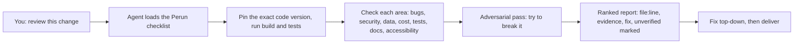

# Perun for leaders

**Bottom line:** Perun is a free checklist that makes an AI coding assistant review software the same careful way every time. It finds more real bugs than a plain "review this" request, at about 1.75 times the usage cost for one pass and 3.5 times for the two-pass setting. Running the plain assistant twice recovers part of the gain more cheaply ([source](../.claude/skills/deep-code-review/references/method-situational.md)). The evidence is one test, so treat the gain as probable, not proved. A small pilot will tell you whether it pays off for your team.

## What Perun does

It is a set of plain-text instructions your engineers' AI assistant reads before reviewing a change. Every problem it reports names the exact file and line, ranks how serious it is, and says how to fix it. What it cannot confirm, it labels `unverified` instead of guessing. There is no server and no account. See the [sample report](example-review-report.md).

## What changes for a team

- Reviews follow one method instead of the assistant's mood that day. Source: [README](#the-story-one-change-five-steps).
- Each review costs more model usage: one Perun pass costs about $0.121 per case against $0.069 for a plain review (about 1.75 times); two merged passes cost $0.239 (about 3.5 times). Source: [measured table](../.claude/skills/deep-code-review/references/method-situational.md).
- Engineers still decide what to fix. Perun reports; it does not change code on its own.

## Measured numbers

All numbers come from one test of 30 held-out real bug fixes, 3 runs per setup, described in the [measured table](../.claude/skills/deep-code-review/references/method-situational.md). Each line below cites its source.

- Bugs found: plain assistant 21%, Perun one pass 31%, Perun two merged passes 41%, plain assistant run twice 36% (about $0.132 per case). The 41% costs $0.239 per case. Source: [measured table](../.claude/skills/deep-code-review/references/method-situational.md).
- Share of flagged issues that were real: plain 66%, Perun 77%. Source: [measured table](../.claude/skills/deep-code-review/references/method-situational.md).
- Gain over plain: +0.10, but the margin of error runs from 0.00 to +0.21, so "probably better". Source: [measured table](../.claude/skills/deep-code-review/references/method-situational.md).
- Other AI models: unmeasured for review recall, so do not assume the gain carries over.
- Time saved, money saved, customer count: unmeasured. Nobody has measured these yet.

## More on the numbers

- **In plain numbers.** Imagine 100 hidden bugs. The plain assistant finds about 21, Perun with one pass about 31, two independent passes about 41. Source: [measured table](../.claude/skills/deep-code-review/references/method-situational.md).
- **Smaller to read, cheaper to run.** The text an agent must read before every review was cut 19% in v1.501.0, from 28,589 to 23,173 estimated tokens. Nothing was deleted; it moved to files read only when needed. Source: [`CHANGELOG.md`](../CHANGELOG.md), entry 1.501.0.
- **Other models.** A portability check of the skills' own tests on four other models (26 cases) found no significant lift; it did not measure bug-finding. Source: [`CHANGELOG.md`](../CHANGELOG.md), entry 1.495.0.
- **Your own estimate.** Fill in your numbers: (reviews per month) x (about $0.12 to $0.24 each) against (the cost of one bug that reaches customers) x (about 1 extra bug caught per 10 hidden bugs). The result is an estimate from your assumptions, not a measured saving. ([source](../.claude/skills/deep-code-review/references/method-situational.md))

## Risks and controls

- **An agent running commands on a machine.** Control: run it inside the operating-system sandbox where the tool offers one; per-tool status is in [host safety](host-safety.md). Some tools have none, so use a container or virtual machine for those.
- **Private data leaking into code, commits or reports.** Control: a privacy gate blocks names, emails and secrets before anything is committed. See [technical overview](technical-overview.md).
- **Changes published without anyone looking.** Control: Perun never pushes, merges or opens requests by itself; a human does the last step. See the contribution rules in [SKILL.md](../.claude/skills/contribution/SKILL.md).
- **Overconfidence.** Perun misses most bugs. Keep your normal human review.

## Three-step pilot

1. **Pick one team and one repository.** Have an engineer install Perun in review-only mode and turn the sandbox on, following [team install](team-install.md).
2. **Run it on every change for a few weeks, alongside normal review.** Record how many real problems it found that people missed, and the extra usage cost. Both are unmeasured for your code until you do this.
3. **Decide with your own numbers.** Keep it if the problems found are worth more than the extra cost; drop it if not. Cost tips: [token cost tips](token-cost-tips.md).

## The story: one change, five steps

A developer, Jane Smith at Acme Capital (a made-up company), asks her AI
assistant to add a discount-code field to a checkout page (see the [sample report](example-review-report.md)). The change is 200
lines. Here is the same afternoon without and with Perun. The example is
fictional; a sample report in the same format is
[`docs/example-review-report.md`](example-review-report.md).

| Step | Without Perun | With Perun |
|---|---|---|
| **1. Ask** | "Review this change." The assistant reads what it feels like reading. | Same words. The assistant first loads the Perun checklist and pins the exact version of the code it is reviewing, so the report is about one fixed thing. ([sample](example-review-report.md)) |
| **2. Look** | One free-form pass. Which areas get checked (security, data, cost, accessibility) depends on the day. | The assistant runs the build and tests first, then goes through every area that applies: correctness, security, data, performance and cost, reliability, tests, infrastructure, documentation, accessibility. ([sample](example-review-report.md)) |
| **3. Challenge** | The assistant says "looks good". Nobody tries to break it. | A separate adversarial pass tries to break the change on purpose, for example by sending a discount code that is negative or enormous. ([sample](example-review-report.md)) |
| **4. Report** | A friendly paragraph. Hard to tell what is certain and what is a hunch. | A list ranked from Blocker down to Nit. Each item has `file:line`, evidence and a fix. Anything unproven is marked `unverified`. A plain-language summary with a traffic-light score is written for non-coders. ([sample](example-review-report.md)) |
| **5. Deliver** | Jane fixes what she remembers. Her manager sees "reviewed: yes" and cannot tell how deep it went. | Jane fixes the ranked list top-down. Her manager reads the traffic-light summary and sees what was checked, what was not, and what needs a decision. ([sample](example-review-report.md)) |

The point is not that the assistant becomes smarter. It stops skipping steps,
and a reader can tell what was and was not checked.



What one finding looks like (fictional, from
[`docs/example-review-report.md`](example-review-report.md)):

```
### F3 - High - CONFIRMED
Inbound webhook accepts unsigned body
- Evidence: routes/hooks.mjs:22 parses JSON; no signature check. (illustrative, unmeasured)
- Impact: forged events can change another customer's job queue.
- Fix: verify the signature; bind the account to the verified sender.
```

## What each person gets

| You are | You get | Where to look |
|---|---|---|
| **Engineer** | A repeatable review of a PR, a branch or a whole repo, with evidence per finding, in any language. | [Start in 60 seconds](../README.md#start-in-60-seconds), [`SKILL.md`](../.claude/skills/deep-code-review/SKILL.md) |
| **Engineering manager** | A report ranked by severity and a traffic-light summary, so "reviewed" has a visible meaning. | [Example report](example-review-report.md) |
| **Security** | Checks against public web, AI-model and agent security guidance, with `unverified` marked rather than asserted. It complements scanners and human review; it does not replace them. | [`standards-index.md`](standards-index.md), [Limits](#limits) |
| **Finance** | No licence fee. The only spend is your assistant's model usage: about $0.12 per case for one pass in the benchmark, about $0.24 for two. Your own cost depends on size and model. | [Measured numbers](#measured-numbers), [FAQ](#faq) ([source](../.claude/skills/deep-code-review/references/method-situational.md)) |
| **Product and marketing** | A plain-language summary of risk and the decisions that need an owner, without reading code. Optional skills help test a positioning or a metric as hypotheses to check with real users. They never invent market data. | [Optional skills](getting-started.md#skill-catalog) |
| **Running many agents at once** | Rules written as scripts that fail loudly: a cap on how long helpers may report back, proof that "done" means done. | [`docs/for-fleets.md`](for-fleets.md) |

## Limits

- **It misses most bugs.** One pass caught 31% of the benchmark's bugs, so about 7 in 10 were missed; two passes caught 41%. Treat a clean report as "no evidence of problems found", not "no problems". ([source](../.claude/skills/deep-code-review/references/method-situational.md))
- **It is not a replacement** for human review, tests, or a security scanner. It
  checks what an assistant can read; it cannot see production behaviour.
- **One corpus, one model family.** The benchmark is 30 cases measured with one model family. Results are directional, and the recall gain's lower bound touches zero. ([source](../.claude/skills/deep-code-review/references/method-situational.md))
- **A review costs more than a plain prompt.** About 1.75 times for one pass and 3.5 times for two in the benchmark, in exchange for the gains above. ([source](../.claude/skills/deep-code-review/references/method-situational.md))
- **Your code goes where your agent sends it.** Perun sends nothing itself. Use
  an agent whose data handling you accept.
- **Quality follows the agent.** Weaker models follow the checklist less well.
- **Unverified means unverified.** Those findings are leads for a human to
  check, not facts.

## Glossary

- **Agent:** an AI assistant that can read files and run commands, for example
  Claude Code, Cursor, Codex, Copilot, Gemini or Aider.
- **Skill:** a text file of instructions an agent loads when a task matches.
- **Scope:** how much to review. `FILE` is one file, `DIFF` is a change since a
  branch, `FULL` is the whole repository.
- **Severity:** Blocker, Critical, High, Medium, Low, Nit, from most to least
  serious.
- **Gate:** an automatic check that passes or fails, rather than advice an
  agent may skip.
- **Token:** the unit an AI model reads and bills by, roughly a word fragment.
- **Recall (bugs caught):** the share of the known hidden bugs a review found.
- **Adversarial pass:** a step where the reviewer tries to break the change.
- **Overlay:** an optional skill added on top of the default review.
- **Fleet:** several agents working on one project at the same time.

## FAQ

**What does it cost?** Perun is free (MIT). You pay your agent's model usage.
Start with `DIFF` or `FILE` scope to keep a first run small.

**How is this different from a good prompt?** A prompt gives one pass shaped by
the model's mood. Perun fixes the method (pinned commit, same areas every time,
an evidence line per finding, an adversarial pass, a definition of done), and its
detail files and test-covered scripts hold what one prompt cannot. The benchmark
above compares exactly this.

**Which agents work?** Any that can read files: Claude Code, Cursor, Codex,
Copilot, Gemini, Aider, Windsurf, OpenCode, Hermes, Kiro, or a plain chat given
the pasted `SKILL.md`.

**Does my code leave my machine?** Perun sends nothing. Your agent sends code
wherever it already does. The review may fetch public standards pages to confirm
versions.

**When should I skip it?** For a throwaway script where a quick read is enough.

**Why "Perun", and why `deep-code-review`?** The repository and the default
skill are named for what it does. Perun is the project name, after the Slavic
thunder god of order.
